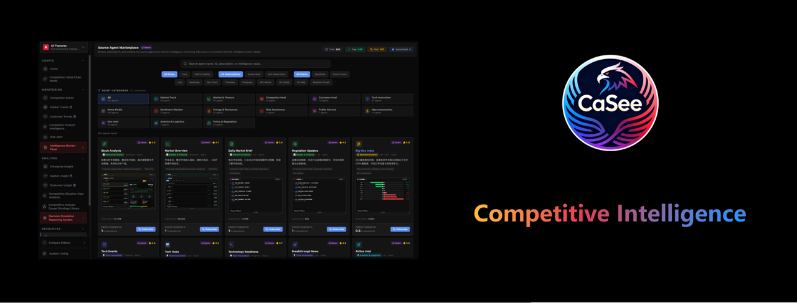

# 🏢 CaSee Intelligence MCP Server

*Enterprise Competitive Intelligence Retrieval for AI Agents — Built on MCP (Model Context Protocol)*

<p align="center">
  
</p>

<p align="center">
  <a href="https://pypi.org/project/casee-mcp-server/"></a>
  <a href="https://www.python.org/downloads/"></a>
  <a href="LICENSE"></a>
  <a href="https://modelcontextprotocol.io"></a>
</p>

***

## 🌐 About CaSee — AI-Driven Competitive Intelligence Platform

**CaSee** is an **AI-driven competitive intelligence & market insight platform** — "Win by strategy, sense opportunities first, decide a thousand miles ahead".

CaSee delivers **trusted-source competitive intelligence** that helps startups find market opportunities and established enterprises expand their competitive advantages. It solves the core pain points of enterprise competitive intelligence:

- Fragmented intelligence collection
- Inefficient manual analysis
- Outdated market insights
- Intelligence that never reaches business decisions

Built for market, sales, product, and strategy teams of mid-to-large enterprises, CaSee connects market data with business decision-making — upgrading from **passive competitive monitoring** to **proactive market trend prediction**.

### Platform Capabilities

| Capability                                 | Description                                                                                                                                                                                                                 |
| ------------------------------------------ | --------------------------------------------------------------------------------------------------------------------------------------------------------------------------------------------------------------------------- |
| **Real-time Competitive Sensing**          | Monitor competitors, markets, and customers for specific business lines; panoramic external environment scanning; real-time threat alerts with tiered control                                                               |
| **Quantified Competitive Threat Analysis** | SWOT, PESTEL, BCG Matrix, VRIO Framework and other systematic analysis tools to evaluate industry profitability, competitive landscape, and policy risks                                                                    |
| **Proactive Strategy Evaluation**          | Proprietary Neural-Causal AI long-chain causal reasoning engine predicts the effects of competitive strategies — open-world reasoning for long-chain causal links, closed-world reasoning for quantified execution outcomes |
| **Trusted Intelligence Collection**        | Real-time competitor tracking, market trend prediction, fusion of fragmented intelligence, goal-oriented targeted intelligence sensing                                                                                      |
| **Expert Competitive Analysis**            | Customized CI analysis capability building, self-service professional reports, and an industry expert knowledge base                                                                                                        |

> **Trusted Intelligence Assurance**: Quantified T-Score credibility scoring, multi-source cross-validation, causal-reasoning bias detection, and compliance guardrails prevent AI agent hallucination, stale data, and false citations.

> **Try CaSee**: <https://casee.me> — get your API key and explore the platform.

***

## 🎯 What is casee-mcp-server?

casee-mcp-server is the **MCP (Model Context Protocol) gateway** that exposes CaSee's competitive intelligence retrieval capabilities as standardized MCP Tools for AI Agents (WorkBuddy, Trae Work, Claude Desktop, LangChain, CrewAI, and any MCP-compatible framework).

It bridges two worlds:

- **CaSee's trusted intelligence backend** — 500+ trusted intelligence sources with T-Score credibility, real-time competitive dynamics, and quantified analysis
- **Your AI Agent** — any LLM application that speaks MCP (stdio or Streamable-HTTP)

With casee-mcp-server, your AI agents gain **real-time, trusted-source intelligence retrieval** from the CaSee platform — turning them from generic chat tools into verifiable competitive intelligence analysts that can search trusted sources, run complex logic retrieval, analyze trends, aggregate by source, and check statistics — all through 5 simple MCP tools.

***

## 🤖 Why casee-mcp-server?

LLM AI Agents (Claude, GPT, etc.) can generate competitive intelligence reports, but their analysis is **limited by training data cutoff dates** and **unverifiable sources**. When you ask an LLM directly about "global EV battery market trends," you get:

- Outdated information (trained months ago)
- Unverifiable sources (hallucinated or unknown provenance)
- Shallow analysis (lacks industry-specific frameworks)

**casee-mcp-server** bridges this gap by giving AI Agents access to **real-time, trusted-source intelligence retrieval**:

| Dimension           | LLM Alone              | With casee-mcp-server                                          |
| ------------------- | ---------------------- | -------------------------------------------------------------- |
| **Source Trust**    | Unknown / hallucinated | 500+ trusted intelligence sources with tscore (0-1) credibility scoring     |
| **Data Freshness**  | Training cutoff date   | Real-time, configurable time window (1-365 days)               |
| **Query Precision** | Natural language only  | Class-Google syntax: `+AND` / `-NOT` / `"phrase"` / `(groups)` |
| **Analysis Depth**  | Surface-level summary  | Trend analysis + source aggregation + statistical overview     |
| **Traceability**    | None                   | Every result links to specific source, date, and tscore        |

> **Core Value**: Transforms AI Agents from "chat tools" into **trusted competitive intelligence analysis systems** — with timely, traceable, and quantifiable intelligence.

***

## 🚀 Quick Start

There are **two ways** to use casee-mcp-server:

| Option | Description | Best For |
|--------|-------------|----------|
| **A. Self-hosted MCP** | Build & run `casee-mcp-server` yourself (pip / source / Docker) | Full control, air-gapped networks, custom tuning, stdio mode |
| **B. Hosted MCP (zero-setup)** | Connect directly to the deployed server at `https://casee.me:8100/mcp` | Fastest time-to-value, no local install |

### Prerequisites

- **Python 3.10+** (only required for Option A)
- **A CaSee API Key** ([get one at https://casee.me](https://casee.me)) — required for both options; every intelligence request is authenticated with it

---

### Option A — Build & Run Your Own MCP Server

#### Step 1: Get a CaSee API Key

Register at [https://casee.me](https://casee.me) and create a **read-only API key** for your agent (we recommend scoping it to `intelligence:read` + `sources:read`). Keep it secret — it authenticates every request.

#### Step 2: Install

```bash
# From PyPI
pip install casee-mcp-server

# Or from source
git clone https://github.com/casee/casee-mcp-server.git
cd casee-mcp-server && pip install -e .
```

#### Step 3: Configure environment variables

```bash
export CASEE_API_KEY=casee_xxx                          # your CaSee API key (casee.me)
export CASEE_API_BASE_URL=https://casee.me # CaSee Intelligence Server URL
```

#### Step 4: Start the server

**stdio mode** — for Claude Desktop and local tools (a local process, one connection):

```bash
casee-mcp
```

**Streamable-HTTP mode** — for WorkBuddy / Trae Work / remote agents (exposes a single HTTP endpoint):

```bash
casee-mcp --http --port 8100
```

The server listens on `http://127.0.0.1:8100/mcp` by default. To expose it on the network, set `MCP_HOST=0.0.0.0`.

#### Step 5: Verify the server is alive

```bash
curl -X POST http://localhost:8100/mcp \
  -H "Content-Type: application/json" \
  -H "Accept: application/json, text/event-stream" \
  -d '{"jsonrpc":"2.0","id":1,"method":"initialize","params":{"protocolVersion":"2025-03-26","capabilities":{},"clientInfo":{"name":"test","version":"1.0"}}}'
```

You should receive an `initialize` result with `serverInfo.name == "casee"`. Then list the tools:

```bash
# after initialize, get the session id from the response header "Mcp-Session-Id"
curl -X POST http://localhost:8100/mcp \
  -H "Content-Type: application/json" \
  -H "Accept: application/json, text/event-stream" \
  -H "Mcp-Session-Id: <your-session-id>" \
  -d '{"jsonrpc":"2.0","id":2,"method":"tools/list","params":{}}'
```

You should see all **5 tools**: `find_trusted_sources`, `search_intelligence`, `analyze_trend`, `aggregate_by_source`, `get_intelligence_stats`.

#### Step 6: Run with Docker (recommended for production)

```bash
# 1. configure your API key
echo "CASEE_API_KEY=casee_xxx" > .env

# 2. build & start
docker compose up -d

# 3. check status
docker compose ps
```

---

### Option B — Connect to the Hosted MCP Server

No installation needed. The server is already deployed and running:

```
MCP endpoint : https://casee.me:8100/mcp
Transport    : Streamable-HTTP
Server       : casee (5 MCP tools)
Backend      : CaSee Intelligence Server (auto-resolved)
```

Just grab your `CASEE_API_KEY` from [https://casee.me](https://casee.me) and plug the URL into your AI agent. Jump straight to [Platform Integrations](#-platform-integrations) for the per-platform walkthrough — no Python, no Docker required.

> **Tip**: For a quick sanity check before wiring a client, run the bundled test suite against the hosted endpoint:
>
> ```bash
> python tests/test_mcp_server.py --url https://casee.me:8100/mcp
> ```

***

## 🧰 MCP Tools

The server exposes **5 MCP Tools** for AI Agents:

| Tool                     | Description                                                     | Key Parameters                                         |
| ------------------------ | --------------------------------------------------------------- | ------------------------------------------------------ |
| `find_trusted_sources`   | Discover trusted sources by category, keyword, region, language | `category`, `min_tscore`, `keyword`, `limit`           |
| `search_intelligence`    | Complex logic retrieval: AND/OR/NOT/phrase/synonym groups       | `q` (query syntax), `source_ids`, `min_tscore`, `days` |
| `analyze_trend`          | Time-series trend analysis of intelligence volume               | `q`, `source_ids`, `days`                              |
| `aggregate_by_source`    | Aggregate by source: count, avg tscore, sample titles           | `q`, `source_ids`, `days`                              |
| `get_intelligence_stats` | Database overview: total intelligence, sources, today's items   | —                                                      |

### Two-Stage Trusted Retrieval Workflow

```
┌────────────────────────────────────────────────────────────────┐
│  Stage 1: find_trusted_sources(category="wire", min_tscore=0.7) │
│  → Returns: [reuters, ap, bloomberg, ...]                       │
└──────────────────────────┬─────────────────────────────────────┘
                           │ source_ids
                           ▼
┌────────────────────────────────────────────────────────────────┐
│  Stage 2: search_intelligence(                                  │
│      q="+EV +(battery|charging) -China",                        │
│      source_ids=["reuters","ap","bloomberg"],                   │
│      min_tscore=0.6, days=30                                    │
│  )                                                              │
│  → Returns: verified, high-quality intelligence results         │
└────────────────────────────────────────────────────────────────┘
```

***

## 🔌 Platform Integrations

Below are **step-by-step walkthroughs** for wiring casee-mcp-server into each platform. Every example works with either:

- **Option A** — your self-hosted server (stdio or `http://127.0.0.1:8100/mcp`)
- **Option B** — the hosted endpoint `https://casee.me:8100/mcp`

> Replace `casee_xxx` with your real key from [https://casee.me](https://casee.me), and replace `https://casee.me:8100/mcp` with your own URL if you self-host.

---

### 1. Claude Desktop

Claude Desktop launches MCP servers as **local stdio processes**, so it works best with **Option A** (or the `url`-based config below on newer versions).

#### Step 1: Install the server locally

```bash
pip install casee-mcp-server
```

#### Step 2: Open the Claude Desktop config file

- **macOS**: `~/Library/Application Support/Claude/claude_desktop_config.json`
- **Windows**: `%APPDATA%\Claude\claude_desktop_config.json`

If the file does not exist, create it.

#### Step 3: Add the `casee-intelligence` server

```json
{
  "mcpServers": {
    "casee-intelligence": {
      "command": "casee-mcp",
      "env": {
        "CASEE_API_KEY": "casee_xxx",
        "CASEE_API_BASE_URL": "https://casee.me"
      }
    }
  }
}
```

#### Step 4: Restart Claude Desktop

Fully quit (Cmd+Q / Alt+F4) and relaunch Claude Desktop so it re-reads the config and spawns the server.

#### Step 5: Verify the tools

Click the **tools (hammer) icon** next to the composer input. You should see `casee-intelligence` with its **5 tools** (`find_trusted_sources`, `search_intelligence`, `analyze_trend`, `aggregate_by_source`, `get_intelligence_stats`).

#### Step 6: Try it

Ask Claude:

> *"Use the casee tools to search for the latest Nvidia competitive intelligence from trusted sources, then summarize the key findings with their credibility scores."*

Claude will call `find_trusted_sources` → `search_intelligence` and answer with traceable sources and tscore values.

> **Alternative — connect to the hosted endpoint (newer Claude Desktop versions)**:
>
> ```json
> {
>   "mcpServers": {
>     "casee-intelligence": {
>       "url": "https://casee.me:8100/mcp",
>       "headers": { "X-API-Key": "casee_xxx" }
>     }
>   }
> }
> ```

---

### 2. WorkBuddy

WorkBuddy connects to MCP servers over **Streamable-HTTP** — ideal for the hosted endpoint (Option B) or your self-hosted server exposed on the network.

#### Step 1: Locate (or create) the WorkBuddy MCP config file

WorkBuddy registers MCP servers through the user-level config file:

```
.workbuddy/mcp.json
```

By convention, this file lives at the user's home directory (`~/.workbuddy/mcp.json` on macOS/Linux, `%USERPROFILE%\.workbuddy\mcp.json` on Windows). If it does not exist, create it.

#### Step 2: Add the `casee-intelligence` server

Edit `.workbuddy/mcp.json` and add an entry under `mcpServers`:

```json
{
  "mcpServers": {
    "casee-intelligence": {
      "transport": "streamable-http",
      "url": "https://casee.me:8100/mcp",
      "headers": {
        "X-API-Key": "casee_xxx"
      }
    }
  }
}
```

Field reference:

| Field | Value | Required | Description |
|-------|-------|----------|-------------|
| `transport` | `streamable-http` | Yes | MCP transport type |
| `url` | `https://casee.me:8100/mcp` | Yes | MCP endpoint (replace with your self-hosted URL if needed) |
| `headers.X-API-Key` | `casee_xxx` | Yes | Your CaSee API key from [casee.me](https://casee.me) |

> **Note**: The `X-API-Key` header is what WorkBuddy will forward on every MCP request so the upstream casee-mcp-server can authenticate against the CaSee Intelligence backend. If you also need to override the backend URL, set it as an environment variable on the **server side** (e.g. in the Docker container's env), not in this client config.

#### Step 3: Save the file and reload WorkBuddy

Save `.workbuddy/mcp.json`, then trigger a config reload in WorkBuddy (typically `Cmd/Ctrl+R` in the MCP panel, or restart the WorkBuddy desktop app).

#### Step 4: Verify the tools

Open the MCP tool panel. You should see `casee-intelligence` with its **5 tools** (`find_trusted_sources`, `search_intelligence`, `analyze_trend`, `aggregate_by_source`, `get_intelligence_stats`).

#### Step 5: Try it

Ask WorkBuddy:

> *"Track the latest EV battery competition signals across trusted sources."*

WorkBuddy will call `find_trusted_sources` → `search_intelligence` and answer with traceable sources and tscore values.

> **Self-hosted variant** — if you run your own MCP server on the same machine, point `url` to `http://127.0.0.1:8100/mcp` instead. The rest of the file stays identical.
>
> ```json
> {
>   "mcpServers": {
>     "casee-intelligence": {
>       "transport": "streamable-http",
>       "url": "http://127.0.0.1:8100/mcp",
>       "headers": {
>         "X-API-Key": "casee_xxx"
>       }
>     }
>   }
> }
> ```

---

### 3. Trae Work

Trae Work registers MCP servers through the global config file `~/.trae-cn/mcp_servers.json` and connects over **Streamable-HTTP**.

#### Step 1: Locate the MCP config file

```
~/.trae-cn/mcp_servers.json
```

If it does not exist, create it.

#### Step 2: Add the `casee-intelligence` entry

```json
{
  "mcpServers": {
    "casee-intelligence": {
      "transport": "streamable-http",
      "url": "https://casee.me:8100/mcp"
    }
  }
}
```

For self-hosted: point `url` to `http://127.0.0.1:8100/mcp` instead.

#### Step 3: Reload / restart Trae Work

Reload the MCP configuration (or restart Trae Work) so it picks up the new server.

#### Step 4: Verify the tools

Open the MCP tool panel. You should see `casee-intelligence` with **5 tools**. Enable the ones you need.

#### Step 5: Ask for intelligence

Example prompt:

> *"Use casee search to find recent AI regulation developments, filter by trusted sources only, and summarize the trend over the last 30 days."*

---

### 4. LangChain Integration

LangChain agents consume MCP tools through the official `mcp` Python client. The example below wraps `casee-mcp` into a LangChain `BaseTool` (stdio mode — Option A).

#### Step 1: Install dependencies

```bash
pip install casee-mcp-server mcp langchain
```

#### Step 2: Define the tool

```python
from mcp import ClientSession, StdioServerParameters
from mcp.client.stdio import stdio_client
from langchain.agents import initialize_agent, AgentType
from langchain.llms import OpenAI
from langchain.tools import BaseTool

class CaseeSearchTool(BaseTool):
    name = "casee_search"
    description = "Search competitive intelligence with query syntax: +AND, -NOT, |synonyms"

    def _run(self, query: str) -> str:
        import asyncio
        return asyncio.run(self._arun(query))

    async def _arun(self, query: str) -> str:
        async with stdio_client(
            StdioServerParameters(
                command="casee-mcp",
                env={"CASEE_API_KEY": "casee_xxx"}
            )
        ) as (read, write):
            async with ClientSession(read, write) as session:
                await session.initialize()
                result = await session.call_tool("search_intelligence",
                    arguments={"q": query, "days": 30})
                return result.content[0].text

llm = OpenAI(temperature=0)
agent = initialize_agent(
    tools=[CaseeSearchTool()], llm=llm,
    agent=AgentType.ZERO_SHOT_REACT_DESCRIPTION
)
agent.run("Find EV battery competition intelligence from trusted sources")
```

#### Step 3: Run the agent

The agent now decides when to call `casee_search` during its reasoning loop, giving your LLM real-time, trusted-source data instead of stale training knowledge.

> **Connecting to the hosted endpoint** — use `StreamableHttpClient` against `https://casee.me:8100/mcp` instead of `stdio_client`:
>
> ```python
> from mcp.client.streamable_http import streamable_http_client
> from mcp import ClientSession
>
> async def call_hosted(query: str) -> str:
>     async with streamable_http_client(
>         url="https://casee.me:8100/mcp",
>         headers={"X-API-Key": "casee_xxx"},
>     ) as (read, write):
>         async with ClientSession(read, write) as session:
>             await session.initialize()
>             result = await session.call_tool(
>                 "search_intelligence", arguments={"q": query, "days": 30})
>             return result.content[0].text
> ```

---

### 5. CrewAI Integration

CrewAI agents use LangChain-style tools. Wrap the MCP call in a `@tool`-decorated function so your Crew agents can retrieve intelligence during their tasks (stdio mode — Option A).

#### Step 1: Install dependencies

```bash
pip install casee-mcp-server mcp langchain crewai
```

#### Step 2: Define the tool & Crew

```python
from crewai import Agent, Task, Crew, Process
from mcp import ClientSession, StdioServerParameters
from mcp.client.stdio import stdio_client
from langchain.tools import tool

@tool
async def search_intel(q: str) -> str:
    """Search competitive intelligence. q: query syntax like +EV +(battery|charging)"""
    async with stdio_client(
        StdioServerParameters(command="casee-mcp", env={"CASEE_API_KEY": "casee_xxx"})
    ) as (read, write):
        async with ClientSession(read, write) as session:
            await session.initialize()
            result = await session.call_tool("search_intelligence",
                arguments={"q": q, "days": 30})
            return result.content[0].text

analyst = Agent(
    role="Competitive Intelligence Analyst",
    goal="Retrieve and analyze market intelligence from trusted sources",
    tools=[search_intel],
)

task = Task(
    description="Search for EV battery technology intelligence and summarize key findings",
    agent=analyst,
)

crew = Crew(agents=[analyst], tasks=[task], process=Process.sequential)
result = crew.kickoff()
```

#### Step 3: Run the crew

`crew.kickoff()` runs the analyst agent, which calls `search_intel` to pull real-time intelligence into its analysis.

> **Connecting to the hosted endpoint** — swap `stdio_client` for `streamable_http_client(url="https://casee.me:8100/mcp", headers={"X-API-Key": "casee_xxx"})` exactly as shown in the LangChain section above.

***

## 🐳 Docker Deployment

```bash
# Clone and build
git clone https://github.com/casee/casee-mcp-server.git
cd casee-mcp-server

# Set your API key
echo "CASEE_API_KEY=casee_xxx" > .env

# Start
docker compose up -d

# Check health
docker compose ps
curl -X POST http://localhost:8100/mcp \
  -H "Content-Type: application/json" \
  -d '{"jsonrpc":"2.0","id":1,"method":"initialize","params":{"protocolVersion":"2025-03-26","capabilities":{},"clientInfo":{"name":"test","version":"1.0"}}}'
```

***

## ⚙️ Configuration

| Environment Variable | Required | Default                      | Description                               |
| -------------------- | -------- | ---------------------------- | ----------------------------------------- |
| `CASEE_API_KEY`      | Yes      | —                            | CaSee API Key (get at <https://casee.me>) |
| `CASEE_API_BASE_URL` | No       | `https://casee.me` | CaSee Intelligence Server URL             |
| `CASEE_TIMEOUT`      | No       | `30`                         | Request timeout (seconds)                 |
| `MCP_TRANSPORT`      | No       | `stdio`                      | `stdio` or `streamable-http`              |
| `MCP_HOST`           | No       | `127.0.0.1`                  | Streamable-HTTP listen address            |
| `MCP_PORT`           | No       | `8100`                       | Streamable-HTTP listen port               |
| `MCP_PATH`           | No       | `/mcp`                       | Streamable-HTTP endpoint path             |

***

## 📊 Architecture

```
┌──────────────────────────────────────────────────────────────────┐
│                     AI Agent Platform Layer                        │
│  ┌──────────┐  ┌──────────┐  ┌──────────────┐  ┌────────────┐   │
│  │WorkBuddy │  │ Trae Work│  │Claude Desktop│  │LangChain   │   │
│  └────┬─────┘  └────┬─────┘  └──────┬───────┘  └─────┬──────┘   │
└───────┼──────────────┼──────────────┼───────────────┼───────────┘
        │              │              │               │
        │     MCP Protocol (stdio / Streamable-HTTP)   │
        │              │              │               │
┌───────┴──────────────┴──────────────┴───────────────┴───────────┐
│                    casee-mcp-server (this project)                 │
│  ┌──────────────────────────────────────────────────────────┐   │
│  │  Tools: find_trusted_sources / search_intelligence /     │   │
│  │         analyze_trend / aggregate_by_source / stats      │   │
│  └──────────────────────────────────────────────────────────┘   │
│  ┌──────────────────────────────────────────────────────────┐   │
│  │  casee SDK (search_sources / search_advanced / ...)       │   │
│  └──────────────────────────────────────────────────────────┘   │
└───────────────────────────┬─────────────────────────────────────┘
                            │  HTTP (X-API-Key)
┌───────────────────────────┴─────────────────────────────────────┐
│  CaSee Intelligence Server (is_server)                            │
│  /v1/sources/search  │  /v1/searchx  │  /v1/search  │  ...      │
└─────────────────────────────────────────────────────────────────┘
```

***

## 🎯 Use Cases — Competitive Intelligence in Action

This chapter walks through a complete, end-to-end competitive intelligence workflow, applied through `casee-mcp-server`'s 5 MCP tools. Every step is given both as a **direct API call** and as the equivalent **MCP Tool invocation** your AI agent will use.

### Scenario — Global EV Market Intelligence

A market intelligence team at an automotive OEM needs to track the global **New Energy Vehicle (NEV / EV)** market in real time:

| Dimension | Value |
|-----------|-------|
| **Vendors** | Tesla, BYD, NIO, Xpeng, Li Auto, Volkswagen |
| **Products** | EV, electric vehicle, battery, charging, BEV, plug-in hybrid |
| **Target markets** | China, Europe, US, Southeast Asia |
| **Topics** | market share, pricing strategy, battery tech, charging infra, policy & regulation |
| **Trust requirement** | only high-credibility sources (tscore ≥ 0.6) |
| **Time window** | last 30 days |

---

### Step 1 — Define the Intelligence Requirement

Translate the business requirement into a structured query:

| Group | Type | Terms |
|-------|------|-------|
| Vendor | OR | `Tesla` \| `BYD` \| `NIO` \| `Xpeng` \| `"Li Auto"` \| `Volkswagen` |
| Product | AND | `(EV \| "electric vehicle" \| battery \| charging)` |
| Market | OR | `China` \| `Europe` \| `US` \| `"Southeast Asia"` |
| Exclude | NOT | `rumor` \| `gossip` |

In **Google-style query syntax** (the `q` parameter of `search_intelligence`):

```text
+(Tesla|BYD|NIO|Xpeng|Volkswagen) +(EV|"electric vehicle"|battery|charging) +(China|Europe|US) -rumor
```

---

### Step 2 — Find Trusted Sources

**Direct API:**

```bash
curl -H "X-API-Key: $CASEE_API_KEY" \
  "https://casee.me/v1/sources/search?category=wire&min_tscore=0.6&sample_size=2"
```

**Via MCP (call from your agent):**

```text
Tool: find_trusted_sources
Arguments:
  category  = "wire"
  min_tscore = 0.6
  sample_size = 2
  limit     = 20
```

**Response (excerpt):**

```json
{
  "count": 3, "total": 3,
  "sources": [
    {
      "source_id": "reuters-business",
      "name": "Reuters Business",
      "category": "wire",
      "tier": 1,
      "propaganda_risk": "low",
      "state_affiliated": false,
      "tscore": 0.81,
      "sample_data": [
        { "title": "EU tariffs on Chinese EV imports ...", "tscore": 0.81 }
      ]
    }
  ]
}
```

Capture the `source_id` list (e.g. `["reuters-business", "ap-news", "ansa"]`) — they become the `source_ids` argument in Step 3.

---

### Step 3 — Two-Stage Intelligence Retrieval

Use the trusted `source_ids` from Step 2 with the query from Step 1.

**Direct API:**

```bash
curl -G -H "X-API-Key: $CASEE_API_KEY" \
  "https://casee.me/v1/searchx" \
  --data-urlencode 'q=+(Tesla|BYD|NIO|Xpeng|Volkswagen) +(EV|battery|charging) +(China|Europe|US) -rumor' \
  --data-urlencode 'source_ids=reuters-business,ap-news,ansa' \
  --data-urlencode 'min_tscore=0.6' \
  --data-urlencode 'days=30' \
  --data-urlencode 'limit=50'
```

**Via MCP (call from your agent):**

```text
Tool: search_intelligence
Arguments:
  q          = '+(Tesla|BYD|NIO|Xpeng|Volkswagen) +(EV|battery|charging) +(China|Europe|US) -rumor'
  source_ids = ["reuters-business", "ap-news", "ansa"]
  min_tscore = 0.6
  days       = 30
  limit      = 50
```

The result is a list of verified, high-credibility intelligence items — each with `title`, `source_id`, `published_at`, `tscore`, and `url` for full traceability.

---

### Step 4 — Analyze & Visualize the Intelligence

Once you have the trusted items, the agent (or a downstream BI tool) performs four standard analyses. Each is also available as a one-shot MCP Tool call:

| Analysis | Description | MCP Tool |
|----------|-------------|----------|
| **Vendor mention frequency** | How many items mention each vendor | custom aggregation over `search_intelligence` results |
| **Source contribution** | Items / avg-tscore per source | `aggregate_by_source(q, source_ids, days)` |
| **Time-series trend** | Weekly / monthly volume, find inflection points | `analyze_trend(q, source_ids, days)` |
| **Structured export** | JSON for downstream BI / LLM | iterate `search_intelligence` results, dump to JSON |

**Example MCP conversation (the agent calls them in sequence):**

```text
User: "Give me an EV market briefing for the last 30 days, only top sources."

Agent:
  → find_trusted_sources(category="wire", min_tscore=0.7, limit=20)
  → search_intelligence(q='+(Tesla|BYD|NIO|Xpeng|Volkswagen) +(EV|battery|charging) +(China|Europe|US)',
                        source_ids=[...], min_tscore=0.6, days=30)
  → analyze_trend(q='+(Tesla|BYD|NIO|Xpeng|Volkswagen) +(EV|battery|charging) +(China|Europe|US)',
                  source_ids=[...], days=30)
  → aggregate_by_source(q='+(Tesla|BYD|NIO|Xpeng|Volkswagen) +(EV|battery|charging) +(China|Europe|US)',
                        source_ids=[...], days=30)
  → Summarize: vendor-by-vendor movement, regional split, week-over-week change,
              and call out any items with tscore ≥ 0.8 as 'high-credibility signals'.
```

This is the **two-stage trusted retrieval** pattern (see [MCP Tools](#-mcp-tools)): discover sources first, then search with the discovered sources — turning a noisy LLM answer into a **traceable, quantified competitive intelligence brief**.

---

### Other Reference Use Cases

The same pattern works for any vertical. Three additional scenarios documented at [api-docs](https://casee.me/api-docs):

| Scenario | User | Question | Suggested `q` |
|----------|------|----------|---------------|
| **Cloud AI competitive landscape** | Cloud vendor marketing team | "Compare AWS / Azure / GCP AI services — features, pricing, market share, customer cases, last 90 days, tscore ≥ 0.6" | `+(AWS\|Azure\|GCP) +(AI\|"machine learning"\|"cloud AI") +(pricing\|feature\|market) -rumor` |
| **Consumer-electronics demand signals** | Smartwatch product manager | "Analyze consumer feedback on smartwatches — health monitoring demand, battery-life satisfaction" | `+(smartwatch\|"smart watch") +(health\|"battery life"\|fitness) +(review\|feedback\|complaint)` |
| **Global EV market briefing** | Auto industry analyst | "Global NEV market — Tesla/BYD/NIO moves, battery tech trends, regional policy changes, last 30 days, tscore ≥ 0.6" | `+(Tesla\|BYD\|NIO\|Xpeng\|Volkswagen) +(EV\|battery\|charging) +(China\|Europe\|US) -rumor` |

For all three, the agent applies the same four-step pattern: **define query → `find_trusted_sources` → `search_intelligence` → analyze / aggregate / trend → summarize**.

---

### Business Value of This Workflow

| What you get | How it's enabled |
|--------------|------------------|
| **Traceable answers** | Every item links to a `source_id`, `published_at`, and `tscore` — no hallucination |
| **Quantified credibility** | `tscore` (0-1) is computed from tier, category, state-affiliation, propaganda risk |
| **Multi-dimensional analysis** | Trend, source-aggregate, vendor-aggregate, statistical overview — all native MCP tools |
| **Real-time freshness** | `days` parameter (1-365) lets you mix long-window trends with short-window hot signals |
| **Lower manual effort** | Replaces "search → read → filter → copy-paste" with one agent prompt |
| **Pluggable into any stack** | Same 5 tools work from Claude Desktop, WorkBuddy, Trae Work, LangChain, CrewAI |

***

## 📄 License

MIT © [CaSee](https://casee.me)

***

## 🔗 Links

- **API Key**: <https://casee.me>
- **API Documentation**: <https://casee.me/api-docs>
- **CaSee SDK**: <https://casee.me/sdk/>
- **MCP Protocol**: <https://modelcontextprotocol.io>

