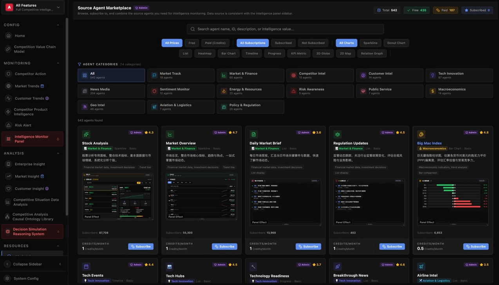
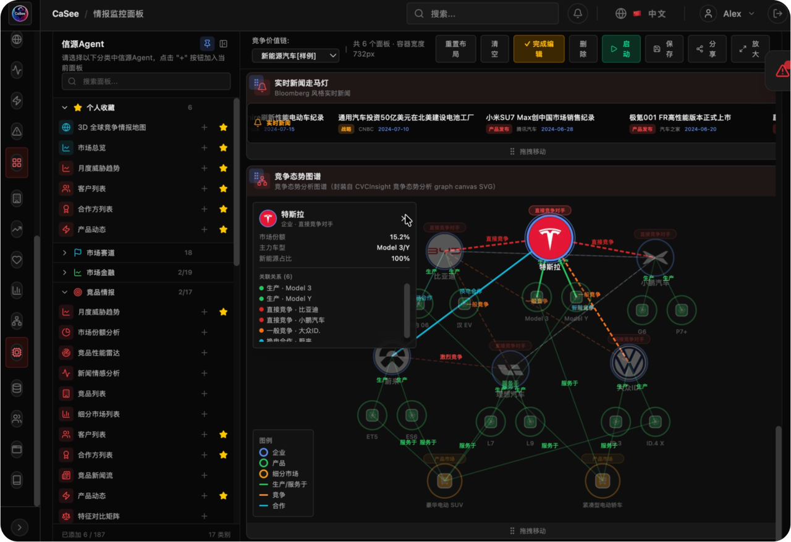
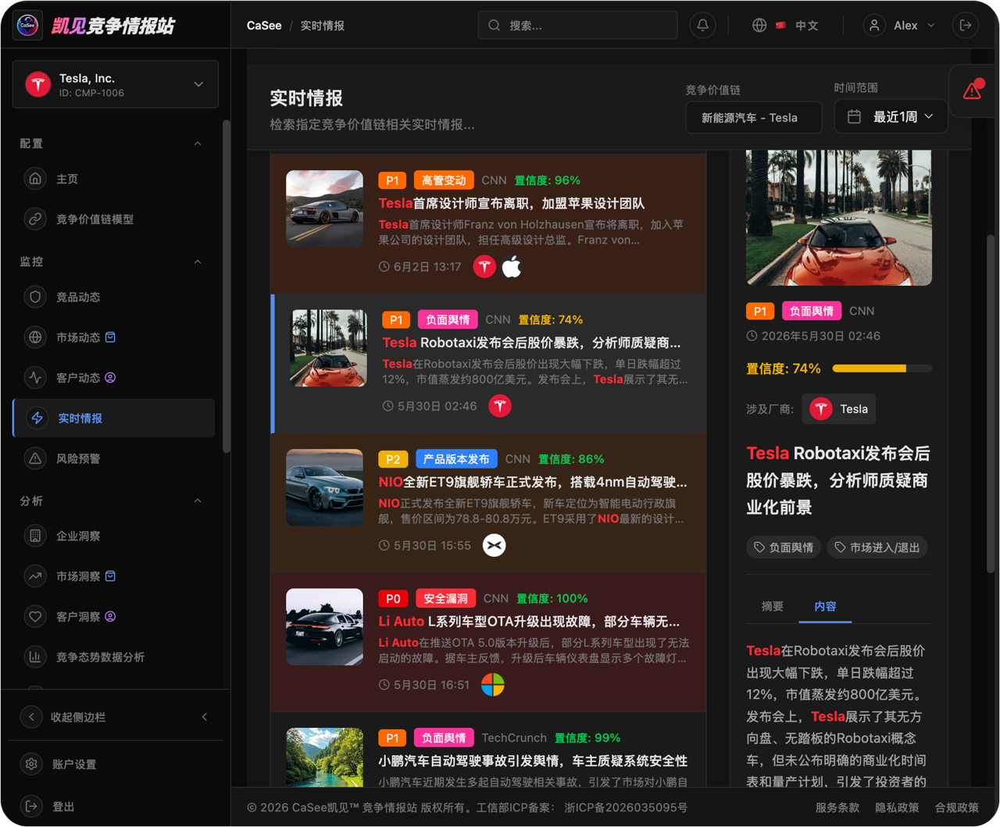
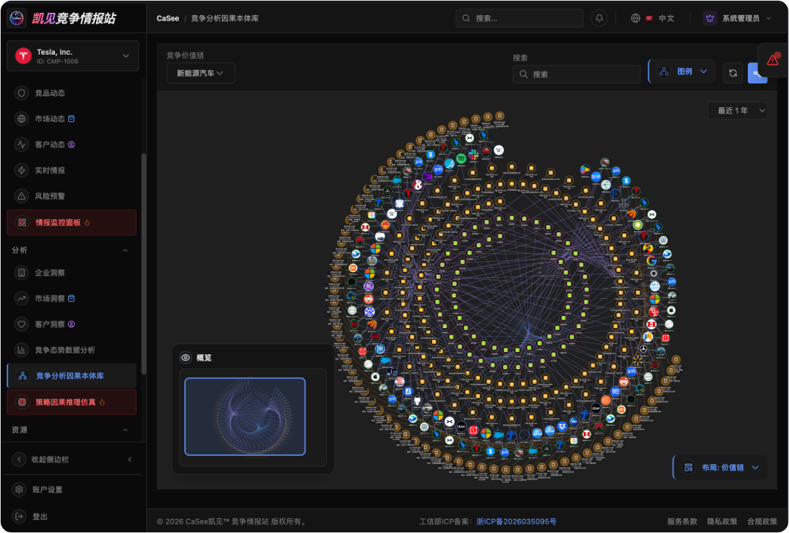

# CaSee 情报 MCP 服务器

*面向 AI Agent 的企业竞争情报检索服务 — 基于 MCP（模型上下文协议）构建*

<p align="center">
  
</p>

<p align="center">
  <a href="https://pypi.org/project/casee-mcp-server/"></a>
  <a href="https://www.python.org/downloads/"></a>
  <a href="LICENSE"></a>
  <a href="https://modelcontextprotocol.io"></a>
</p>

***

## 关于 CaSee — AI 驱动的竞争情报平台

**CaSee** 是一个**AI驱动的竞争情报与市场洞察平台** —— "以策略取胜，先感知机会，决策千里之外"。

CaSee 提供**可信来源的竞争情报**，帮助初创企业发现市场机会，助力成熟企业扩大竞争优势。它解决了企业竞争情报的核心痛点：

- 碎片化的情报收集
- 低效的人工分析
- 过时的市场洞察
- 无法到达业务决策的情报

CaSee 专为中大型企业的市场、销售、产品和战略团队打造，将市场数据与业务决策相连接 —— 从**被动竞争监控**升级为**主动市场趋势预测**。

### 平台能力

| 能力 | 描述 |
|------|------|
| **实时竞争感知** | 监控竞争对手、市场和客户的特定业务线；全方位外部环境扫描；分级控制的实时威胁预警 |
| **量化竞争威胁分析** | SWOT、PESTEL、BCG矩阵、VRIO框架等系统化分析工具，评估行业盈利能力、竞争格局和政策风险 |
| **主动战略评估** | 专有Neural-Causal AI长链因果推理引擎预测竞争战略的效果 —— 开放世界推理用于长链因果联系，封闭世界推理用于量化执行结果 |
| **可信情报采集** | 实时竞争对手追踪、市场趋势预测、碎片化情报融合、目标导向的定向情报感知 |
| **专家竞争分析** | 定制化CI分析能力建设、自助专业报告和行业专家知识库 |

> **可信情报保证**：量化T-Score可信度评分、多源交叉验证、因果推理偏见检测和合规护栏，防止AI Agent幻觉、数据过时和错误引用。

> **体验CaSee**：<https://casee.me> — 获取您的API密钥并探索平台。


<p align="center">
  
</p>

***

## 🎯 什么是 casee-mcp-server？

casee-mcp-server 是**MCP（模型上下文协议）网关**，将 CaSee 的竞争情报检索能力暴露为标准化的 MCP 工具，供 AI Agent（WorkBuddy、Trae Work、Claude Desktop、LangChain、CrewAI 及任何兼容 MCP 的框架）使用。

它连接了两个世界：

- **CaSee 的可信情报后端** — 500+ 可信情报源，提供 T-Score 可信度评分、实时竞争动态和量化分析
- **您的 AI Agent** — 任何支持 MCP 的 LLM 应用（stdio 或 Streamable-HTTP）

通过 casee-mcp-server，您的 AI Agent 可以从 CaSee 平台获取**实时、可信来源的情报检索** — 从通用聊天工具转变为可验证的竞争情报分析师，能够检索可信来源、运行复杂逻辑检索、分析趋势和按来源聚合 — 所有功能通过 6 个简单的 MCP 工具实现。

***

<p align="center">
  
</p>


## 🤖 为什么选择 casee-mcp-server？

LLM AI Agent（Claude、GPT等）可以生成竞争情报报告，但其分析**受限于训练数据截止日期**和**不可验证的来源**。当您直接向 LLM 询问"全球电动车电池市场趋势"时，您得到的是：

- 过时的信息（几个月前训练的）
- 不可验证的来源（幻觉或未知来源）
- 浅层分析（缺乏行业特定框架）

**casee-mcp-server** 通过为 AI Agent 提供**实时、可信来源的情报检索**来弥合这一差距：

| 维度 | 仅使用 LLM | 使用 casee-mcp-server |
|------|------------|----------------------|
| **来源可信度** | 未知 / 幻觉 | 500+ 可信情报源，带 tscore (0-1) 可信度评分 |
| **数据新鲜度** | 训练截止日期 | 实时，可配置时间窗口（1-365天） |
| **查询精度** | 仅自然语言 | 类Google语法：`+AND` / `-NOT` / `"短语"` / `(分组)` |
| **分析深度** | 表面总结 | 趋势分析 + 来源聚合 |
| **可追溯性** | 无 | 每个结果都链接到特定来源、日期和 tscore |

> **核心价值**：将 AI Agent 从"聊天工具"转变为**可信的竞争情报分析系统** —— 提供及时、可追溯、可量化的情报。

***

## 🚀 快速开始

使用 casee-mcp-server 有**两种方式**：

| 选项 | 描述 | 适用场景 |
|------|------|----------|
| **A. 自托管 MCP** | 自己构建和运行 `casee-mcp-server`（pip / 源码 / Docker） | 完全控制、离线网络、自定义调优、stdio模式 |
| **B. 托管 MCP（零配置）** | 直接连接到已部署的服务器 `https://casee.me/mcp` | 最快的上线时间，无需本地安装 |

### 先决条件

- **Python 3.10+**（仅选项A需要）
- **CaSee API Key**（在 <https://casee.me> 获取）— 两种选项都需要；每个情报请求都需要认证

---

### 选项 A — 构建和运行自己的 MCP 服务器

#### 第 1 步：获取 CaSee API Key

在 [https://casee.me](https://casee.me) 注册并创建一个**只读 API Key** 给您的 Agent（建议将其范围限定为 `intelligence:read` + `sources:read`）。请妥善保管 —— 它会为每个请求进行认证。

#### 第 2 步：安装

```bash
# 从 PyPI 安装
pip install casee-mcp-server

# 或从源码安装
git clone https://github.com/casee/casee-mcp-server.git
cd casee-mcp-server && pip install -e .
```

#### 第 3 步：配置环境变量

```bash
export CASEE_API_KEY=casee_xxx                          # 您的 CaSee API Key (casee.me)
export CASEE_API_BASE_URL=https://casee.me # CaSee 情报服务器 URL
```

#### 第 4 步：启动服务器

**stdio 模式** — 适用于 Claude Desktop 和本地工具（本地进程，一个连接）：

```bash
casee-mcp
```

**Streamable-HTTP 模式** — 适用于 WorkBuddy / Trae Work / 远程 Agent（暴露单个 HTTP 端点）：

```bash
casee-mcp --http --port 8100
```

服务器默认监听 `http://127.0.0.1:8100/mcp`。要在网络上暴露，请设置 `MCP_HOST=0.0.0.0`。

#### 第 5 步：验证服务器是否正常运行

```bash
curl -X POST http://localhost:8100/mcp \
  -H "Content-Type: application/json" \
  -H "Accept: application/json, text/event-stream" \
  -d '{"jsonrpc":"2.0","id":1,"method":"initialize","params":{"protocolVersion":"2025-03-26","capabilities":{},"clientInfo":{"name":"test","version":"1.0"}}}'
```

您应该收到一个 `initialize` 结果，其中 `serverInfo.name == "casee"`。然后列出工具：

```bash
# 初始化后，从响应头 "Mcp-Session-Id" 获取会话 ID
curl -X POST http://localhost:8100/mcp \
  -H "Content-Type: application/json" \
  -H "Accept: application/json, text/event-stream" \
  -H "Mcp-Session-Id: <your-session-id>" \
  -d '{"jsonrpc":"2.0","id":2,"method":"tools/list","params":{}}'
```

您应该看到所有 **6 个工具**：`find_trusted_sources`、`search_intelligence`、`analyze_trend`、`aggregate_by_source`、`semantic_search_tool`、`search_with_cvc`。

#### 第 6 步：使用 Docker 运行（生产环境推荐）

```bash
# 1. 配置您的 API Key
echo "CASEE_API_KEY=casee_xxx" > .env

# 2. 构建并启动
docker compose -f docker/docker-compose.yml up -d

# 3. 检查状态
docker compose -f docker/docker-compose.yml ps
```

---

### 选项 B — 连接到托管 MCP 服务器

无需安装。服务器已部署并运行：

```
MCP 端点 : https://casee.me/mcp
传输协议    : Streamable-HTTP
服务器       : casee（6 个 MCP 工具）
后端      : CaSee 情报服务器（自动解析）
```

只需从 [https://casee.me](https://casee.me) 获取您的 `CASEE_API_KEY`，并将 URL 接入您的 AI Agent。直接跳转到[平台集成](#-平台集成)部分，查看每个平台的逐步指南 — 无需 Python，无需 Docker。

> **提示**：在配置客户端之前，快速检查的方法是对托管端点运行附带的测试套件：
>
> ```bash
> python tests/test_mcp_server.py --url https://casee.me/mcp
> ```

***

## 🧰 MCP 工具

服务器为 AI Agent 暴露 **6 个 MCP 工具**，支持传统的基于关键词的检索和高级语义检索：

| 工具 | 描述 | 关键参数 |
|------|------|----------|
| `find_trusted_sources` | 按类别、关键词、地区、语言发现可信来源 | `category`、`min_tscore`、`keyword`、`limit` |
| `search_intelligence` | 复杂逻辑检索：AND/OR/NOT/短语/同义词组 | `q`（查询语法）、`source_ids`、`min_tscore`、`days` |
| `analyze_trend` | 情报量的时间序列趋势分析 | `q`、`source_ids`、`days` |
| `aggregate_by_source` | 按来源聚合：计数、平均 tscore、示例标题 | `q`、`source_ids`、`days` |
| `semantic_search_tool` | 通过 CVC 模型进行语义检索：BM25 + 向量 ANN + RRF 融合 | `cvc_model_id`、`q`、`mode`、`top_k`、`days`、`min_tscore` |
| `search_with_cvc` | 带可选 CVC 模型同步的关键词检索，用于语义索引 | `q`、`cvc_model_id`、`source_ids`、`min_tscore`、`days` |

### 两阶段可信检索工作流（关键词检索）

```
┌────────────────────────────────────────────────────────────────┐
│  阶段 1: find_trusted_sources(category="wire", min_tscore=0.7) │
│  → 返回：[reuters, ap, bloomberg, ...]                         │
└──────────────────────────┬─────────────────────────────────────┘
                           │ source_ids
                           ▼
┌────────────────────────────────────────────────────────────────┐
│  阶段 2: search_intelligence(                                    │
│      q="+EV +(battery|charging) -China",                        │
│      source_ids=["reuters","ap","bloomberg"],                   │
│      min_tscore=0.6, days=30                                    │
│  )                                                              │
│  → 返回：经过验证的高质量情报结果                                 │
└────────────────────────────────────────────────────────────────┘
```

### 语义检索工作流（CVC 模型）

对于需要更深语义理解的场景（如竞品分析、市场趋势发现、客户需求分析），CaSee 提供基于**竞争价值链（CVC）**的语义检索工作流：

```
┌────────────────────────────────────────────────────────────────────────┐
│  步骤 1: 构建 CVC 模型（一次性设置）                                    │
│  • 通过 search_with_cvc(cvc_model_id="...") 收集情报项                  │
│  • 系统自动将情报项索引到 Qdrant 向量数据库中                            │
│  • CVC 模型就绪，可用于语义检索                                         │
└──────────────────────────┬─────────────────────────────────────────────┘
                           │
                           ▼
┌────────────────────────────────────────────────────────────────────────┐
│  步骤 2: 语义检索                                                      │
│  semantic_search_tool(                                                │
│      cvc_model_id="cvc_abc12345",                                     │
│      q="竞争对手最新AI芯片技术突破",                                     │
│      mode="hybrid",        # hybrid | semantic | keyword              │
│      top_k=20,                                                       │
│      days=30,                                                        │
│      min_tscore=0.5                                                  │
│  )                                                                    │
│  → 返回：带有融合分数的语义匹配结果                                     │
└────────────────────────────────────────────────────────────────────────┘
```

#### 语义检索模式

| 模式 | 描述 | 使用场景 |
|------|------|----------|
| `hybrid`（默认） | 结合BM25关键词匹配 + 向量相似度 + RRF融合 | 最佳通用检索，平衡精度和召回率 |
| `semantic` | 仅向量相似度检索 | 查找跨不同术语的概念相关情报 |
| `keyword` | 仅BM25关键词匹配 | 精确术语匹配，响应更快 |

#### CVC 模型 ID 格式

CVC 模型 ID 遵循模式 `cvc_[a-z0-9]{8,32}`：
- 必须以 `cvc_` 前缀开头
- 后跟 8-32 个小写字母数字字符
- 示例：`cvc_abc12345`、`cvc_market_intel_2024`

***

## 🔌 平台集成

以下是将 casee-mcp-server 接入各平台的**逐步指南**。每个示例都适用于：

- **选项 A** — 您自托管的服务器（stdio 或 `http://127.0.0.1:8100/mcp`）
- **选项 B** — 托管端点 `https://casee.me/mcp`

> 将 `casee_xxx` 替换为您从 [https://casee.me](https://casee.me) 获取的真实密钥，如果您是自托管的，将 `https://casee.me/mcp` 替换为您自己的 URL。

---

### 1. Claude Desktop

Claude Desktop 以**本地 stdio 进程**的形式启动 MCP 服务器，因此最适合与**选项 A** 配合使用（或使用下面基于 `url` 的配置）。

#### 第 1 步：在本地安装服务器

```bash
pip install casee-mcp-server
```

#### 第 2 步：打开 Claude Desktop 配置文件

- **macOS**：`~/Library/Application Support/Claude/claude_desktop_config.json`
- **Windows**：`%APPDATA%\Claude\claude_desktop_config.json`

如果文件不存在，请创建。

#### 第 3 步：添加 `casee-intelligence` 服务器

```json
{
  "mcpServers": {
    "casee-intelligence": {
      "command": "casee-mcp",
      "env": {
        "CASEE_API_KEY": "casee_xxx",
        "CASEE_API_BASE_URL": "https://casee.me"
      }
    }
  }
}
```

#### 第 4 步：重启 Claude Desktop

完全退出（Cmd+Q / Alt+F4）并重新启动 Claude Desktop，以便重新读取配置并生成服务器。

#### 第 5 步：验证工具

点击作曲家输入框旁边的**工具（锤子）图标**。您应该看到 `casee-intelligence` 及其 **6 个工具**（`find_trusted_sources`、`search_intelligence`、`analyze_trend`、`aggregate_by_source`、`semantic_search_tool`、`search_with_cvc`）。

#### 第 6 步：试用

询问 Claude：

> *"使用 casee 工具从可信来源搜索最新的 Nvidia 竞争情报，然后总结关键发现及其可信度评分。"*

Claude 将调用 `find_trusted_sources` → `search_intelligence` 并提供可追溯的来源和 tscore 值的回答。

> **备选方案 — 连接到托管端点（较新版本的 Claude Desktop）**：
>
> ```json
> {
>   "mcpServers": {
>     "casee-intelligence": {
>       "url": "https://casee.me/mcp",
>       "headers": { "X-API-Key": "casee_xxx" }
>     }
>   }
> }
> ```

---

### 2. WorkBuddy

WorkBuddy 通过**Streamable-HTTP**连接 MCP 服务器 — 非常适合托管端点（选项 B）或您在网络上暴露的自托管服务器。

#### 第 1 步：定位（或创建）WorkBuddy MCP 配置文件

WorkBuddy 通过用户级配置文件注册 MCP 服务器：

```
.workbuddy/mcp.json
```

按照惯例，此文件位于用户主目录下（macOS/Linux 上为 `~/.workbuddy/mcp.json`，Windows 上为 `%USERPROFILE%\.workbuddy\mcp.json`）。如果不存在，请创建。

#### 第 2 步：添加 `casee-intelligence` 服务器

编辑 `.workbuddy/mcp.json` 并在 `mcpServers` 下添加一个条目：

```json
{
  "mcpServers": {
    "casee-intelligence": {
      "transport": "streamable-http",
      "url": "https://casee.me/mcp",
      "headers": {
        "X-API-Key": "casee_xxx"
      }
    }
  }
}
```

字段参考：

| 字段 | 值 | 必需 | 描述 |
|------|------|------|------|
| `transport` | `streamable-http` | 是 | MCP 传输类型 |
| `url` | `https://casee.me/mcp` | 是 | MCP 端点（如有需要，替换为您自托管的 URL） |
| `headers.X-API-Key` | `casee_xxx` | 是 | 您的 CaSee API Key（来自 [casee.me](https://casee.me)） |

> **注意**：`X-API-Key` 头部是 WorkBuddy 将转发的每个 MCP 请求的内容，以便上游的 casee-mcp-server 可以对 CaSee 情报后端进行认证。如果您还需要覆盖后端 URL，请在**服务器端**（例如 Docker 容器的环境变量中）设置，而不是在此客户端配置中。

#### 第 3 步：保存文件并重新加载 WorkBuddy

保存 `.workbuddy/mcp.json`，然后在 WorkBuddy 中触发配置重新加载（通常在 MCP 面板中为 `Cmd/Ctrl+R`，或重启 WorkBuddy 桌面应用）。

#### 第 4 步：验证工具

打开 MCP 工具面板。您应该看到 `casee-intelligence` 及其 **6 个工具**（`find_trusted_sources`、`search_intelligence`、`analyze_trend`、`aggregate_by_source`、`semantic_search_tool`、`search_with_cvc`）。

#### 第 5 步：试用

询问 WorkBuddy：

> *"追踪可信来源中最新的电动车电池竞争信号。"*

WorkBuddy 将调用 `find_trusted_sources` → `search_intelligence` 并提供可追溯的来源和 tscore 值的回答。

> **自托管变体** — 如果您在同一台机器上运行自己的 MCP 服务器，请将 `url` 指向 `http://127.0.0.1:8100/mcp`。文件的其余部分保持不变。
>
> ```json
> {
>   "mcpServers": {
>     "casee-intelligence": {
>       "transport": "streamable-http",
>       "url": "http://127.0.0.1:8100/mcp",
>       "headers": {
>         "X-API-Key": "casee_xxx"
>       }
>     }
>   }
> }
> ```

---

### 3. Trae Work

Trae Work 通过全局配置文件 `~/.trae-cn/mcp_servers.json` 注册 MCP 服务器，并通过 **Streamable-HTTP** 连接。

#### 第 1 步：定位 MCP 配置文件

```
~/.trae-cn/mcp_servers.json
```

如果不存在，请创建。

#### 第 2 步：添加 `casee-intelligence` 条目

```json
{
  "mcpServers": {
    "casee-intelligence": {
      "transport": "streamable-http",
      "url": "https://casee.me/mcp"
    }
  }
}
```

对于自托管：将 `url` 指向 `http://127.0.0.1:8100/mcp`。

#### 第 3 步：重新加载 / 重启 Trae Work

重新加载 MCP 配置（或重启 Trae Work），以便它获取新服务器。

#### 第 4 步：验证工具

打开 MCP 工具面板。您应该看到 `casee-intelligence` 包含 **6 个工具**。根据需要启用。

#### 第 5 步：请求情报

示例提示：

> *"使用 casee 检索查找最近的 AI 监管发展，仅筛选可信来源，并总结过去 30 天的趋势。"*

---

### 4. LangChain 集成

LangChain Agent 通过官方的 `mcp` Python 客户端使用 MCP 工具。下面的示例将 `casee-mcp` 封装成一个 LangChain `BaseTool`（stdio 模式 — 选项 A）。

#### 第 1 步：安装依赖

```bash
pip install casee-mcp-server mcp langchain
```

#### 第 2 步：定义工具

```python
from mcp import ClientSession, StdioServerParameters
from mcp.client.stdio import stdio_client
from langchain.agents import initialize_agent, AgentType
from langchain.llms import OpenAI
from langchain.tools import BaseTool

class CaseeSearchTool(BaseTool):
    name = "casee_search"
    description = "使用查询语法检索竞争情报：+AND, -NOT, |同义词"

    def _run(self, query: str) -> str:
        import asyncio
        return asyncio.run(self._arun(query))

    async def _arun(self, query: str) -> str:
        async with stdio_client(
            StdioServerParameters(
                command="casee-mcp",
                env={"CASEE_API_KEY": "casee_xxx"}
            )
        ) as (read, write):
            async with ClientSession(read, write) as session:
                await session.initialize()
                result = await session.call_tool("search_intelligence",
                    arguments={"q": query, "days": 30})
                return result.content[0].text

llm = OpenAI(temperature=0)
agent = initialize_agent(
    tools=[CaseeSearchTool()], llm=llm,
    agent=AgentType.ZERO_SHOT_REACT_DESCRIPTION
)
agent.run("从可信来源查找电动车电池竞争情报")
```

#### 第 3 步：运行 Agent

Agent 现在决定何时在其推理循环中调用 `casee_search`，为您的 LLM 提供实时、可信来源的数据，而不是过时的训练知识。

> **连接到托管端点** — 改为使用 `StreamableHttpClient` 连接 `https://casee.me/mcp` 而不是 `stdio_client`：
>
> ```python
> from mcp.client.streamable_http import streamable_http_client
> from mcp import ClientSession
>
> async def call_hosted(query: str) -> str:
>     async with streamable_http_client(
>         url="https://casee.me/mcp",
>         headers={"X-API-Key": "casee_xxx"},
>     ) as (read, write):
>         async with ClientSession(read, write) as session:
>             await session.initialize()
>             result = await session.call_tool(
>                 "search_intelligence", arguments={"q": query, "days": 30})
>             return result.content[0].text
> ```

---

### 5. CrewAI 集成

CrewAI Agent 使用 LangChain 风格的工具。将 MCP 调用封装在 `@tool` 装饰的函数中，以便您的 Crew Agent 可以在任务期间检索情报（stdio 模式 — 选项 A）。

#### 第 1 步：安装依赖

```bash
pip install casee-mcp-server mcp langchain crewai
```

#### 第 2 步：定义工具和 Crew

```python
from crewai import Agent, Task, Crew, Process
from mcp import ClientSession, StdioServerParameters
from mcp.client.stdio import stdio_client
from langchain.tools import tool

@tool
async def search_intel(q: str) -> str:
    """检索竞争情报。q：查询语法，如 +EV +(battery|charging)"""
    async with stdio_client(
        StdioServerParameters(command="casee-mcp", env={"CASEE_API_KEY": "casee_xxx"})
    ) as (read, write):
        async with ClientSession(read, write) as session:
            await session.initialize()
            result = await session.call_tool("search_intelligence",
                arguments={"q": q, "days": 30})
            return result.content[0].text

analyst = Agent(
    role="竞争情报分析师",
    goal="从可信来源检索和分析市场情报",
    tools=[search_intel],
)

task = Task(
    description="检索电动车电池技术情报并总结关键发现",
    agent=analyst,
)

crew = Crew(agents=[analyst], tasks=[task], process=Process.sequential)
result = crew.kickoff()
```

#### 第 3 步：运行 Crew

`crew.kickoff()` 运行分析师 Agent，该 Agent 调用 `search_intel` 将实时情报拉入其分析中。

> **连接到托管端点** — 正如 LangChain 部分所示，将 `stdio_client` 替换为 `streamable_http_client(url="https://casee.me/mcp", headers={"X-API-Key": "casee_xxx"})`。

***

## 🐳 Docker 部署

```bash
# 克隆并构建
git clone https://github.com/casee/casee-mcp-server.git
cd casee-mcp-server

# 设置您的 API Key
echo "CASEE_API_KEY=casee_xxx" > .env

# 启动
docker compose -f docker/docker-compose.yml up -d

# 检查健康状态
docker compose -f docker/docker-compose.yml ps
curl -X POST http://localhost:8100/mcp \
  -H "Content-Type: application/json" \
  -d '{"jsonrpc":"2.0","id":1,"method":"initialize","params":{"protocolVersion":"2025-03-26","capabilities":{},"clientInfo":{"name":"test","version":"1.0"}}}'
```

***

## ⚙️ 配置

| 环境变量 | 必需 | 默认值 | 描述 |
|---------|------|--------|------|
| `CASEE_API_KEY` | 是 | — | CaSee API Key（在 <https://casee.me> 获取） |
| `CASEE_API_BASE_URL` | 否 | `https://casee.me` | CaSee 情报服务器 URL |
| `CASEE_TIMEOUT` | 否 | `30` | 请求超时（秒） |
| `MCP_TRANSPORT` | 否 | `stdio` | `stdio` 或 `streamable-http` |
| `MCP_HOST` | 否 | `127.0.0.1` | Streamable-HTTP 监听地址 |
| `MCP_PORT` | 否 | `8100` | Streamable-HTTP 监听端口 |
| `MCP_PATH` | 否 | `/mcp` | Streamable-HTTP 端点路径 |

***

## 📊 架构

```
┌──────────────────────────────────────────────────────────────────┐
│                     AI Agent 平台层                                │
│  ┌──────────┐  ┌──────────┐  ┌──────────────┐  ┌────────────┐   │
│  │WorkBuddy │  │ Trae Work│  │Claude Desktop│  │LangChain   │   │
│  └────┬─────┘  └────┬─────┘  └──────┬───────┘  └─────┬──────┘   │
└───────┼──────────────┼──────────────┼───────────────┼───────────┘
        │              │              │               │
        │     MCP 协议 (stdio / Streamable-HTTP)   │
        │              │              │               │
┌───────┴──────────────┴──────────────┴───────────────┴───────────┐
│                    casee-mcp-server (本项目)                      │
│  ┌──────────────────────────────────────────────────────────┐   │
│  │  工具: find_trusted_sources / search_intelligence /      │   │
│  │         analyze_trend / aggregate_by_source /            │   │
│  │         semantic_search_tool / search_with_cvc           │   │
│  └──────────────────────────────────────────────────────────┘   │
│  ┌──────────────────────────────────────────────────────────┐   │
│  │  casee SDK (search_sources / search_advanced /            │   │
│  │              semantic_search / ...)                       │   │
│  └──────────────────────────────────────────────────────────┘   │
└───────────────────────────┬─────────────────────────────────────┘
                            │  HTTP (X-API-Key)
┌───────────────────────────┴─────────────────────────────────────┐
│  CaSee 情报服务器 (is_server)                                    │
│  /v1/sources/search  │  /v1/searchx  │  /v1/search  │           │
│  /v1/semantic-search  │  /v1/cvc/*  │  ...                       │
└─────────────────────────────────────────────────────────────────┘
```

***

## 🎯 使用场景 — 竞争情报实战

本章将通过 `casee-mcp-server` 的 6 个 MCP 工具，完成一个完整的端到端竞争情报工作流。每个步骤都提供**直接 API 调用**和您的 AI Agent 将使用的等效**MCP 工具调用**。

### 场景 — 全球电动车市场情报

一家汽车 OEM 市场情报团队需要实时跟踪全球**新能源汽车（NEV / EV）**市场：

| 维度 | 值 |
|------|------|
| **供应商** | Tesla、BYD、NIO、Xpeng、Li Auto、Volkswagen |
| **产品** | EV、电动汽车、电池、充电、BEV、插电混合动力 |
| **目标市场** | 中国、欧洲、美国、东南亚 |
| **主题** | 市场份额、定价策略、电池技术、充电基础设施、政策与法规 |
| **可信度要求** | 仅高可信度来源（tscore ≥ 0.6） |
| **时间窗口** | 最近 30 天 |

---
<p align="center">
  
</p>


### 步骤 1 — 定义情报需求

将业务需求转化为结构化查询：

| 分组 | 类型 | 术语 |
|------|------|------|
| 供应商 | OR | `Tesla` \| `BYD` \| `NIO` \| `Xpeng` \| `"Li Auto"` \| `Volkswagen` |
| 产品 | AND | `(EV \| "electric vehicle" \| battery \| charging)` |
| 市场 | OR | `China` \| `Europe` \| `US` \| `"Southeast Asia"` |
| 排除 | NOT | `rumor` \| `gossip` |

在**类Google查询语法**（`search_intelligence` 的 `q` 参数）中：

```text
+(Tesla|BYD|NIO|Xpeng|Volkswagen) +(EV|"electric vehicle"|battery|charging) +(China|Europe|US) -rumor
```

---

### 步骤 2 — 查找可信来源

**直接 API：**

```bash
curl -H "X-API-Key: $CASEE_API_KEY" \
  "https://casee.me/v1/sources/search?category=wire&min_tscore=0.6&sample_size=2"
```

**通过 MCP（从您的 Agent 调用）：**

```text
工具: find_trusted_sources
参数:
  category  = "wire"
  min_tscore = 0.6
  sample_size = 2
  limit     = 20
```

**响应（节选）：**

```json
{
  "count": 3, "total": 3,
  "sources": [
    {
      "source_id": "reuters-business",
      "name": "Reuters Business",
      "category": "wire",
      "tier": 1,
      "propaganda_risk": "low",
      "state_affiliated": false,
      "tscore": 0.81,
      "sample_data": [
        { "title": "EU对中国电动车进口征收关税...", "tscore": 0.81 }
      ]
    }
  ]
}
```

捕获 `source_id` 列表（例如 `["reuters-business", "ap-news", "ansa"]`）— 它们将成为步骤 3 中的 `source_ids` 参数。

---

### 步骤 3 — 两阶段情报检索

使用步骤 2 中的可信 `source_ids` 和步骤 1 中的查询。

**直接 API：**

```bash
curl -G -H "X-API-Key: $CASEE_API_KEY" \
  "https://casee.me/v1/searchx" \
  --data-urlencode 'q=+(Tesla|BYD|NIO|Xpeng|Volkswagen) +(EV|battery|charging) +(China|Europe|US) -rumor' \
  --data-urlencode 'source_ids=reuters-business,ap-news,ansa' \
  --data-urlencode 'min_tscore=0.6' \
  --data-urlencode 'days=30' \
  --data-urlencode 'limit=50'
```

<p align="center">
  
</p>


**通过 MCP（从您的 Agent 调用）：**

```text
工具: search_intelligence
参数:
  q          = '+(Tesla|BYD|NIO|Xpeng|Volkswagen) +(EV|battery|charging) +(China|Europe|US) -rumor'
  source_ids = ["reuters-business", "ap-news", "ansa"]
  min_tscore = 0.6
  days       = 30
  limit      = 50
```

结果是经过验证的高质量情报项列表 — 每个项都有 `title`、`source_id`、`published_at`、`tscore` 和 `url`，用于完全可追溯。

---

### 步骤 4 — 分析和可视化情报

获得可信的项后，Agent（或下游 BI 工具）执行四种标准分析。每种分析也作为一次性 MCP 工具调用可用：

| 分析 | 描述 | MCP 工具 |
|------|------|----------|
| **供应商提及频率** | 每个供应商被提及的项数 | 在 `search_intelligence` 结果上的自定义聚合 |
| **来源贡献** | 每个来源的项数 / 平均 tscore | `aggregate_by_source(q, source_ids, days)` |
| **时间序列趋势** | 每周/每月的数量，查找拐点 | `analyze_trend(q, source_ids, days)` |
| **结构化导出** | 用于下游 BI / LLM 的 JSON | 迭代 `search_intelligence` 结果，导出为 JSON |

**MCP 对话示例（Agent 依次调用它们）：**

```text
用户: "给我一份过去 30 天的电动车市场简报，仅限顶级来源。"

Agent:
  → find_trusted_sources(category="wire", min_tscore=0.7, limit=20)
  → search_intelligence(q='+(Tesla|BYD|NIO|Xpeng|Volkswagen) +(EV|battery|charging) +(China|Europe|US)',
                        source_ids=[...], min_tscore=0.6, days=30)
  → analyze_trend(q='+(Tesla|BYD|NIO|Xpeng|Volkswagen) +(EV|battery|charging) +(China|Europe|US)',
                  source_ids=[...], days=30)
  → aggregate_by_source(q='+(Tesla|BYD|NIO|Xpeng|Volkswagen) +(EV|battery|charging) +(China|Europe|US)',
                        source_ids=[...], days=30)
  → 总结：逐个供应商的动态、区域分布、周环比变化，并将 tscore ≥ 0.8 的任何项标记为"高可信度信号"。
```

这就是**两阶段可信检索**模式（参见 [MCP 工具](#-mcp-工具)）：先发现来源，再用发现的来源搜索 — 将嘈杂的 LLM 答案转化为**可追溯、量化的竞争情报简报**。

---

### 其他参考用例

相同的模式适用于任何垂直领域。在 [api-docs](https://casee.me/api-docs) 中记录了三个额外场景：

| 场景 | 用户 | 问题 | 建议的 `q` |
|------|------|------|-----------|
| **云 AI 竞争格局** | 云供应商营销团队 | "比较 AWS / Azure / GCP AI 服务 — 功能、定价、市场份额、客户案例、最近 90 天、tscore ≥ 0.6" | `+(AWS\|Azure\|GCP) +(AI\|"machine learning"\|"cloud AI") +(pricing\|feature\|market) -rumor` |
| **消费电子需求信号** | 智能手表产品经理 | "分析关于智能手表的客户反馈 — 健康监测需求、电池续航满意度" | `+(smartwatch\|"smart watch") +(health\|"battery life"\|fitness) +(review\|feedback\|complaint)` |
| **全球电动车市场简报** | 汽车行业分析师 | "全球新能源汽车市场 — Tesla/BYD/NIO 动态、电池技术趋势、区域政策变化、最近 30 天、tscore ≥ 0.6" | `+(Tesla\|BYD\|NIO\|Xpeng\|Volkswagen) +(EV\|battery\|charging) +(China\|Europe\|US) -rumor` |

对于所有三个场景，Agent 应用相同的四步模式：**定义查询 → `find_trusted_sources` → `search_intelligence` → 分析 / 聚合 / 趋势 → 总结**。

---

### 此工作流的业务价值

| 您获得什么 | 如何实现 |
|-----------|----------|
| **可追溯的答案** | 每个项都链接到 `source_id`、`published_at` 和 `tscore` — 无幻觉 |
| **量化的可信度** | `tscore`（0-1）由层级、类别、国家关联、宣传风险计算得出 |
| **多维分析** | 趋势、来源聚合、供应商聚合 — 所有都是原生 MCP 工具 |
| **实时新鲜度** | `days` 参数（1-365）允许您混合长期趋势与短期热点信号 |
| **更少的手动工作** | 将"搜索 → 阅读 → 筛选 → 复制粘贴"替换为一个 Agent 提示 |
| **可插拔到任何栈** | 相同的 6 个工具适用于 Claude Desktop、WorkBuddy、Trae Work、LangChain、CrewAI |

***

## 🔄 语言

- [English](README.md)
- [中文](README_zh.md)

***

## 💡 语义检索示例

### 示例 1：使用语义检索进行竞品分析

使用语义检索分析竞品 AI 芯片技术突破：

```python
# 通过收集情报构建 CVC 模型
search_with_cvc(
    q="+NVIDIA +(AI|chip|GPU) +(breakthrough|launch|announcement)",
    cvc_model_id="cvc_nvidia_ai_chip",
    days=90,
    min_tscore=0.6
)

# 执行语义检索
semantic_search_tool(
    cvc_model_id="cvc_nvidia_ai_chip",
    q="最新AI芯片技术突破和市场动态",
    mode="hybrid",
    top_k=20,
    days=30,
    min_tscore=0.5
)
```

### 示例 2：市场趋势发现

通过超越关键词匹配发现新兴市场趋势：

```python
# 步骤 1: 创建市场情报 CVC 模型
search_with_cvc(
    q="+market +(trend|growth|emerging) +(technology|AI|cloud)",
    cvc_model_id="cvc_market_trends_2024",
    days=180,
    min_tscore=0.5
)

# 步骤 2: 语义检索相关概念
semantic_search_tool(
    cvc_model_id="cvc_market_trends_2024",
    q="新兴技术市场机会和增长趋势",
    mode="semantic",  # 纯语义检索用于概念匹配
    top_k=30,
    days=90,
    min_tscore=0.4
)
```

### 示例 3：客户需求分析

跨不同术语分析客户需求和痛点：

```python
# 构建客户声音 CVC 模型
search_with_cvc(
    q="+customer +(feedback|complaint|review|need) +(product|service|experience)",
    cvc_model_id="cvc_customer_voice",
    days=90,
    min_tscore=0.4
)

# 语义检索客户需求
semantic_search_tool(
    cvc_model_id="cvc_customer_voice",
    q="用户痛点和产品改进建议",
    mode="hybrid",
    top_k=25,
    days=30,
    min_tscore=0.4
)
```

### 响应格式

语义检索响应包含融合统计信息：

```json
{
  "count": 15,
  "items": [...],
  "fusion": {
    "mode": "hybrid",
    "vector_hits": 15,
    "bm25_hits": 12,
    "degraded": []
  },
  "search_information": {
    "fusion": {
      "vector_hits": 15,
      "bm25_hits": 12,
      "degraded": []
    }
  }
}
```

***

## 📄 许可证

MIT © [CaSee](https://casee.me)

***

## 🔗 链接

- **API Key**: <https://casee.me>
- **API 文档**: <https://casee.me/api-docs>
- **CaSee SDK**: <https://casee.me/sdk/>
- **MCP 协议**: <https://modelcontextprotocol.io>